# A4: Generative Models — Teaching Guide

A walkthrough of GAN → CycleGAN → DDPM with the story behind each.

---

## Opening: The Core Problem

**What to say:**

> "Every model we've seen so far is discriminative — given an image, predict a label. Today we flip the problem: given nothing, generate a realistic image. That's generative modeling."

**The fundamental difficulty:**

> "A 32×32 RGB image has 3,072 pixel values. The space of all possible images is astronomically large. But the subset that looks like a real photograph is a tiny, complicated manifold inside that space. We need to learn to sample from that manifold."

Three families, three different strategies:

| Approach | Core Idea | Pros | Cons |
|---|---|---|---|
| **GAN** | Adversarial game: generator vs discriminator | Fast inference, sharp images | Unstable training, mode collapse |
| **VAE** | Encode to latent, decode back | Stable, smooth latent space | Blurry outputs |
| **Diffusion** | Iteratively denoise from noise | High quality, diverse | Slow sampling (1000 steps) |


---

## Part 1: GAN (Cells 4–7)

### Before GAN: the VAE approach (tell this before any code)

**What to say:**

> "Before GANs, the standard generative model was the VAE — Variational Autoencoder. Encode an image to a compressed latent vector z, then decode z back to an image. Training just minimizes reconstruction error."

$$\mathcal{L}_{VAE} = \underbrace{\|x - \hat{x}\|^2}_{\text{reconstruction loss}} + \underbrace{D_{KL}\big(q(z|x) \,\|\, p(z)\big)}_{\text{regularize latent space}}$$

> "The first term — recon_loss — is just pixel-wise MSE: how far is my reconstruction from the original? That's the whole training signal for 'does this look right.'"

**The blurry image problem:**

> "MSE is an average over pixels. When the decoder is uncertain about a sharp edge or fine texture, the safest bet — the one that minimizes expected MSE — is to output something blurry, an average of possibilities, rather than commit to one sharp answer. Nothing in the loss ever says 'this looks fake.' It only ever says 'how far off, on average.' That's structurally why VAEs produce blurry samples."

**Pause and ask:**

> "If two equally plausible sharp images exist for some patch of a face, what does an MSE-trained decoder do?"
>
> Answer: It averages them — producing a blurry blend of both, because that minimizes expected squared error better than committing to either sharp option.

### The GAN idea: from "compression" to "catching fakes"

**What to say:**

> "In 2014, Ian Goodfellow had an insight at a bar. What if instead of asking a decoder to minimize reconstruction error, you train a second network whose only job is to catch fakes? The generator never sees pixel targets — it only learns from whether it fooled the judge."

> "VAE asks: how close is my reconstruction, pixel by pixel? GAN asks: would a judge mistake this for real? That shift from compression to detection is what fixes the blur — a discriminator can flag any sharp-but-wrong detail as fake, but MSE has no way to penalize blur itself."

**The minimax game:**

```
Generator G:      noise z → fake image
Discriminator D:  image → real or fake?
```

$$\min_G \max_D \; \mathbb{E}_{x}[\log D(x)] + \mathbb{E}_{z}[\log(1 - D(G(z)))]$$

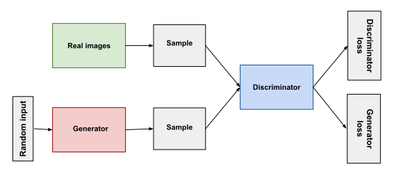

**Intuition to give:**

> "D wants to output 1 for real, 0 for fake — maximize both log terms. G wants D to output 1 for its fakes — minimize log(1 − D(G(z))). They're playing a game where both get better by competing."

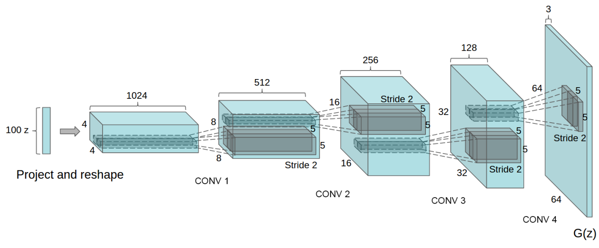

**The balance problem:**

> "If D is too strong, it always outputs ~0 for fakes. The gradient of log(1 − D(G(z))) → 0. G has no signal to improve. They must stay roughly matched throughout training. This is the hardest part of GAN training."

**Mode collapse:**

> "G discovers a shortcut: if it always generates the digit '1', D struggles to say that's fake because '1' is a real digit. So G just outputs '1' forever. The generator has found a mode of the distribution and is exploiting it instead of covering the full distribution."

**Pause and ask:**

> "If G collapses to always generating '1', what does D learn to do? And then what does G do?"
>
> Answer: D learns to say '1' is fake. Then G switches to '2'. Then D adapts. They chase each other — this is the GAN training instability spiral.

**Per-epoch timing:**

The training cell records `gan_epoch_times`. Point out to students: GAN generates 64 images in a single forward pass (~milliseconds). This becomes relevant when comparing to DDPM's 1000-step sampling.

---

## Part 2: CycleGAN (Cells 8–14)

### Why paired data is the bottleneck

**What to say:**

> "The original GAN and DCGAN both need paired data — for every input you need the ground-truth output. For MNIST that's easy. But for real tasks: if you want to convert a photo to an anime drawing, you'd need every celebrity to be drawn as an anime character. That dataset doesn't exist."

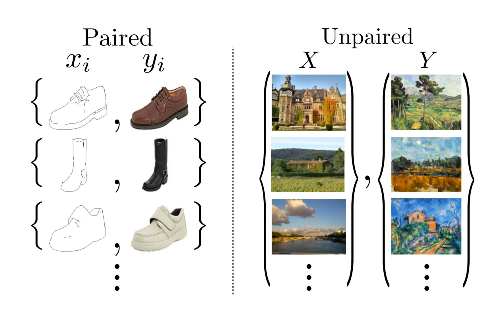

**CycleGAN's insight (Zhu et al., 2017):**

> "Train two generators at once: G translates X→Y, F translates Y→X. Then enforce a simple constraint: if you translate an image to the other domain and back, you should recover the original. That's cycle consistency — and it's enough to learn meaningful translation without any paired examples."

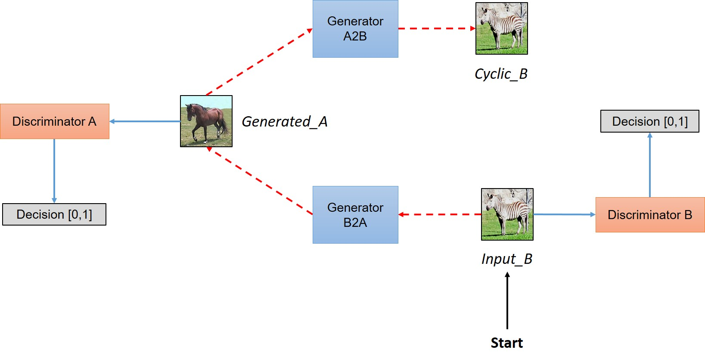

The full model has two generators and two discriminators — one per domain:

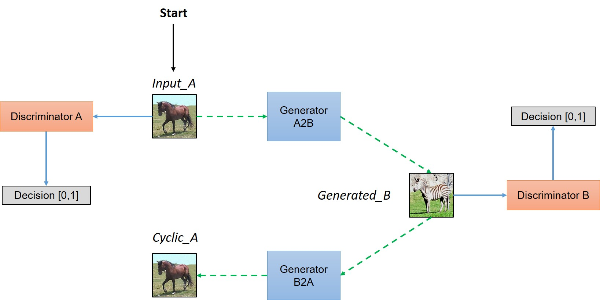

### The three loss terms

**Walk through each one:**

**1. Adversarial loss** (makes outputs look realistic):

$$\mathcal{L}_{adv} = \mathbb{E}_y[\log D_Y(y)] + \mathbb{E}_x[\log(1 - D_Y(G(x)))]$$

> "Same as vanilla GAN — D_Y tries to distinguish real blondes from G's fake blondes. G tries to fool D_Y."

**2. Cycle consistency loss** (preserves content):

$$\mathcal{L}_{cyc} = \mathbb{E}_x[\|F(G(x)) - x\|_1] + \mathbb{E}_y[\|G(F(y)) - y\|_1]$$

> "This is the key. Without it, G could map every dark-hair face to the same blonde — and D_Y would be fooled, but nothing useful was learned. Cycle loss forces G to preserve the content of the original."

**3. Identity loss** (preserves color palette):

$$\mathcal{L}_{idt} = \mathbb{E}_y[\|G(y) - y\|_1] + \mathbb{E}_x[\|F(x) - x\|_1]$$

> "If you feed G an image already in domain Y, it should leave it unchanged. This prevents the generators from unnecessarily shifting colors."

**Pause and ask:**

> "If we set λ_cyc = 0 (no cycle consistency), what's the worst the generator could do?"
>
> Answer: G could map every dark-hair face to a single, perfectly convincing blonde face — D_Y is completely fooled, but the generator learned nothing about individual identity. This is Exercise 2.

### Architecture details

**Generator (ResNet-based):**

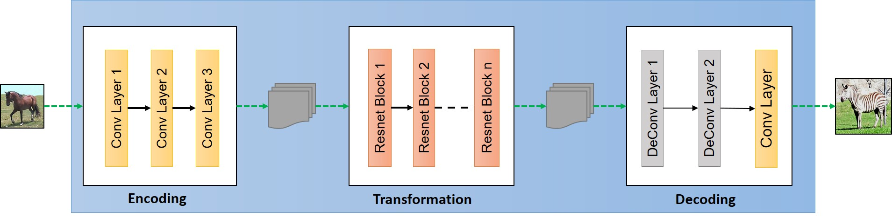

Each residual block:

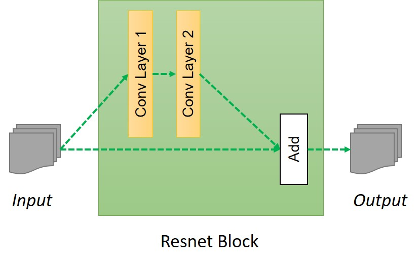

**Why InstanceNorm, not BatchNorm?**

> "BatchNorm normalizes across the batch — it forces a shared mean/variance across all images. For style transfer, you want each image to keep its own statistics. InstanceNorm normalizes each image independently. This is critical for CycleGAN."

**PatchGAN discriminator:**

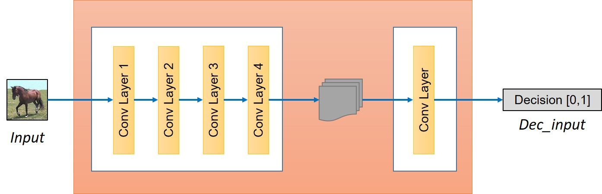

> "Instead of outputting a single scalar (real/fake for the whole image), PatchGAN outputs a grid — each element judges a 70×70 patch. This forces the discriminator to evaluate local texture quality, not just global composition. The result: sharper, more realistic local details."

**Why LSGAN (MSELoss for adversarial) instead of BCE?**

> "LSGAN penalizes outputs far from the decision boundary — it gives a gradient even when the discriminator is very confident. BCE gradients vanish when D outputs near 0 or 1. LSGAN is more stable for image translation tasks."

### Our experiment: CelebA hair color

**What to say:**

> "We split CelebA into dark-hair (Domain X) and blonde-hair (Domain Y) based on the Blond_Hair attribute. The notebook caps each domain at 30,000 images (in practice CelebA's blonde subset only has ~24,000 available). The CycleGAN learns to swap hair color without any paired examples — it never sees a person with both dark and blonde hair."

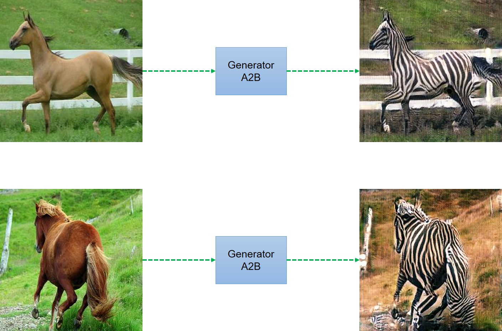

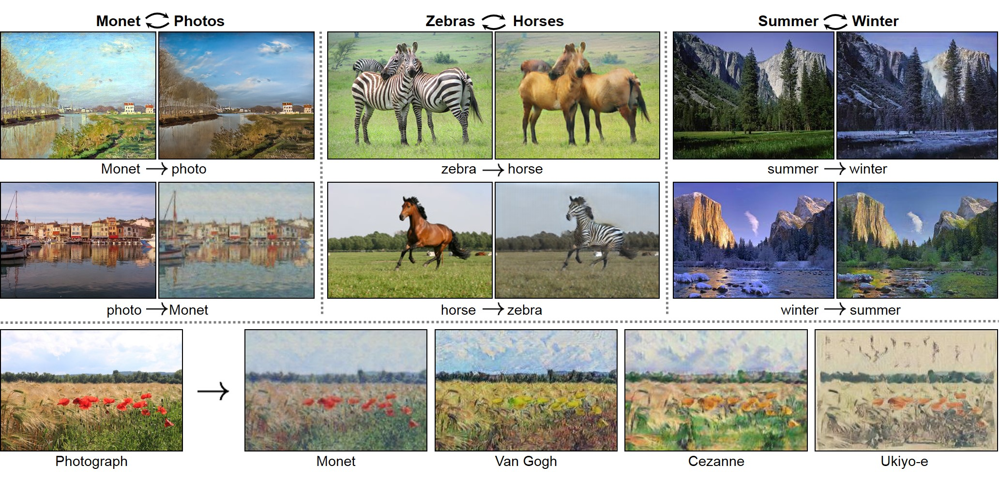

**Realistic expectations:**

> "With 20 epochs and 64×64 images, results will be rough around the edges. The hair region will shift color; other features (skin tone, face structure) should be mostly preserved thanks to cycle loss. Longer training and 256×256 resolution gives the results from the original paper."

**What we actually observed (20 epochs, ~30k/24k images, batch size 16):**

> "G loss dropped steadily from 5.65 → 3.03 and D loss settled around 0.37–0.42 with no collapse or runaway oscillation — a healthy training curve. Each epoch took ~225–300s on the available GPU (~1,516 batches/epoch). This is a good sign to point out to students: stable, monotonic G loss decay is what a *working* CycleGAN run looks like, as opposed to the spiky, oscillating curves you'd see from an unstable GAN."

### Test with your own face

**What to say:**

> "Put my_face.jpg in the notebook folder. The cell will center-crop, resize to 64×64, run it through G (→ blonde) and F (→ dark). You'll see three panels: original | →blonde | →dark."

**What to look for:**

> "Does the hair region change color? Does your face structure stay intact? If the model warps your face heavily, that's a sign cycle loss isn't strong enough, or the training domain is very different from your photo."

**If the result looks bad:**

> "CelebA is biased: mostly Western celebrities, studio lighting, frontal pose. If your photo is different (different lighting, angle, background), the model is out-of-distribution. The generators try to apply what they learned, but it may apply the 'wrong' texture region."

---

## Bridge: GAN → CycleGAN → DDPM

**What to say:**

> "GAN and CycleGAN are fast — inference is a single forward pass. But they're notoriously hard to train. The adversarial game can spiral: if D gets too strong, G gets no gradient; if G gets too strong, D can't distinguish anything. By 2020, the research community was looking for something more stable."

| | GAN / CycleGAN | DDPM |
|---|---|---|
| **Training loss** | Adversarial (unstable) | MSE regression (stable) |
| **Inference** | Single forward pass | 1000 U-Net steps |
| **Mode coverage** | Can collapse | Covers full distribution |
| **Conditioning** | Hard to add text/class | Easy to condition |

> "The tradeoff: diffusion is slower but reliable. You can throw more compute at it and it gets better. GANs plateau — more parameters don't reliably help."

---

## Part 3: DDPM (Cells 15–23)

### The story

**What to say:**

> "Ho et al. (2020) took inspiration from thermodynamics. If you slowly heat a gas until it becomes disordered (forward process), can you learn to reverse the disorder step by step? The answer for images is yes — and the training is just MSE. No adversary."

### The two-process intuition

**Forward process (fixed, not learned):**

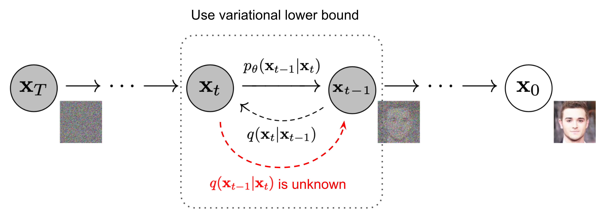

> "Take a real image. Add a tiny amount of Gaussian noise. Repeat 1000 steps. At the end, you have pure noise — the image is completely destroyed. This is just math, no learning involved."

```
x₀ (clean) → x₁ → x₂ → ... → x₁₀₀₀ (pure noise)
              +ε    +ε          +ε
```

**Reverse process (learned):**

> "Can a neural network learn to undo one step of noising? If it can do that, we can chain 1000 reverse steps: start from pure noise and gradually recover a clean image."

**The shortcut formula — explain this carefully:**

$$x_t = \sqrt{\bar{\alpha}_t}\, x_0 + \sqrt{1 - \bar{\alpha}_t}\, \epsilon$$

> "We don't need to run 1000 forward steps during training. This formula jumps directly to any timestep t from the clean image. $\bar{\alpha}_t$ tells you how much signal is left — at t=0 it's 1 (clean image), at t=T it's ~0 (pure noise)."

**Training objective:**

$$\mathcal{L} = \mathbb{E}_{t, x_0, \epsilon}\left[ \| \epsilon - \epsilon_\theta(x_t, t) \|^2 \right]$$

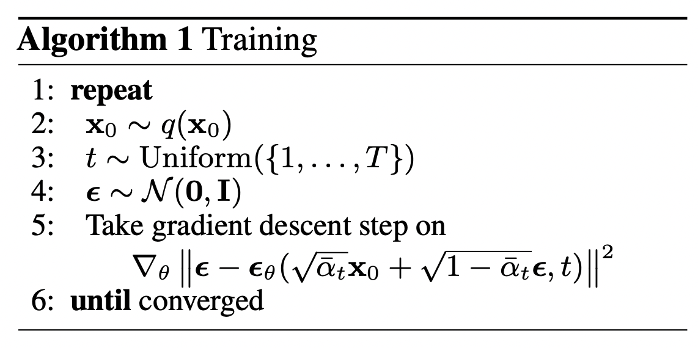

> "Randomly pick a timestep, add the right amount of noise using the shortcut, ask the U-Net: what noise did we add? MSE between predicted and actual noise. That's the entire training loss. No adversarial game."

**What we actually observed (10 epochs, MNIST):**

> "Loss dropped from 0.135 → 0.0265 and was already flattening by epoch 7–8 (0.0289 → 0.0285 → 0.0270 → 0.0265). 10 epochs is enough to get recognizable digits out of the reverse process on MNIST — this is a much smaller, easier dataset than the CelebA faces CycleGAN trains on, which is part of why DDPM training here looks so much faster to converge."

**Pause and ask:**

> "Why do we predict noise ε instead of predicting the clean image x₀ directly?"
>
> Answer: Both are mathematically equivalent — you can derive one from the other. But predicting noise is better empirically: it's a zero-mean signal, easier to learn, and the network gets a consistent target across all timesteps.

### The U-Net as denoiser

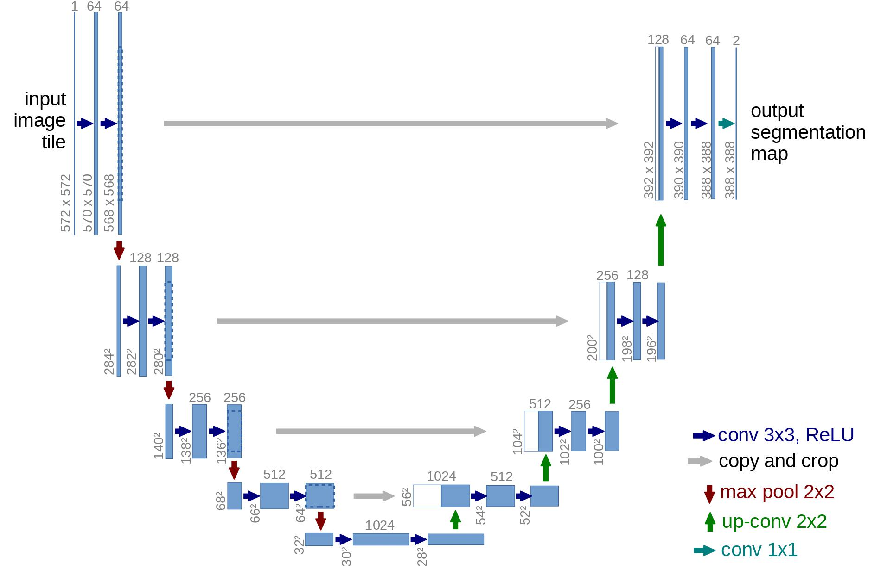

**What to say:**

> "The denoiser takes two inputs: the noisy image AND the timestep t. Why the timestep? At t=999 (almost pure noise), the network should make big corrections. At t=1 (almost clean), tiny corrections. The timestep tells the network how much to correct."

**Sinusoidal embedding:**

> "The timestep t is a scalar — too simple to directly inject. We encode it with sinusoidal embeddings (same idea as positional encoding in Transformers), producing a 256-dim vector. Then inject it into every ResBlock via addition."

**U-Net skip connections:**

> "Encoder captures coarse structure, decoder reconstructs detail. Skip connections let high-resolution features from the encoder bypass the bottleneck — critical for preserving fine details during denoising."

### Sampling — why it's slow

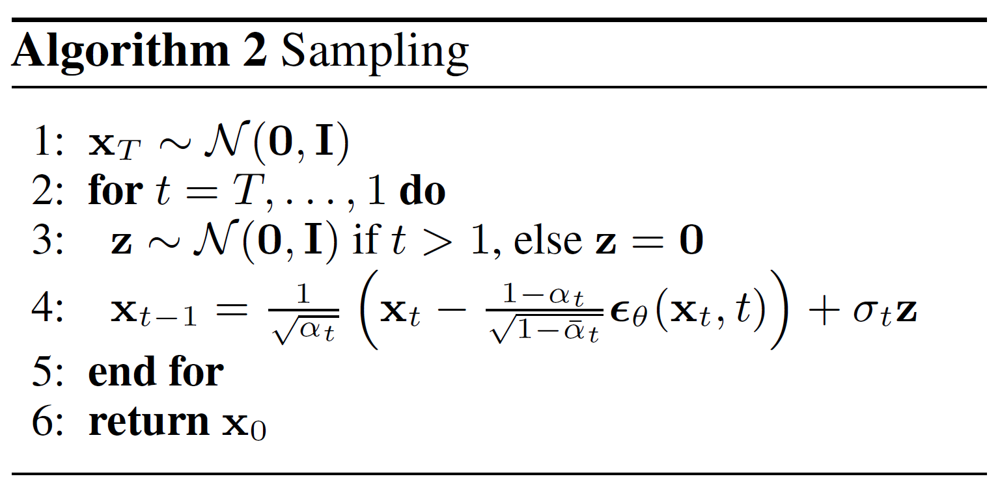

> "To generate one image, we run the U-Net 1000 times. Each run is cheap, but 1000 runs is slow. DDIM (Song et al., 2020) reduces this to 50 steps with comparable quality. That's why modern inference with Stable Diffusion is practical."

### Noise schedule

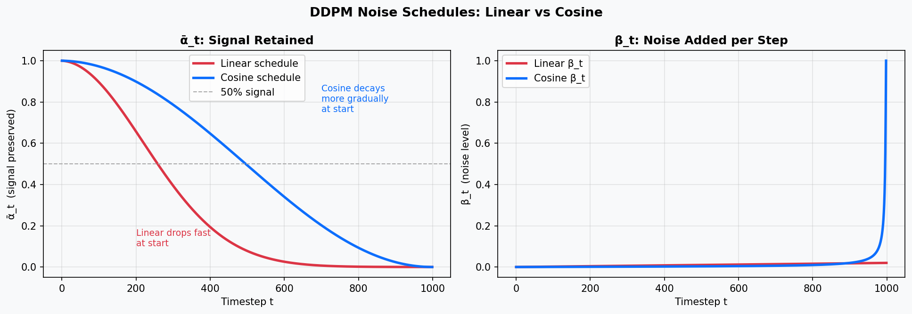

> "Linear schedule: β grows uniformly from 1e-4 to 0.02. Cosine schedule (Nichol & Dhariwal, 2021): ᾱ_t decays slowly at first, then faster. The cosine schedule gives more training examples in the 'interesting' middle range — not trivially easy (pure noise) and not trivially hard (almost clean)."

---

## Exercise Walkthrough Tips

**Ex1 (Mode collapse):** Students visualize the class distribution with a bar chart. A collapsed GAN will show 1–2 bars dominating. For Ex1b, tripling D's learning rate makes D too strong — G's gradients vanish and it collapses to a single output. For Ex1c, connect to WGAN (Earth Mover's distance, no saturation) and minibatch discrimination (D sees diversity across the batch).

**Ex2 (CycleGAN cycle consistency ablation):** With λ_cyc = 0, the generator is free to map any face to any blonde face — it will produce convincing output for D_Y but completely ignore the input. The artifact students should report: with cycle loss, face geometry is preserved; without it, the output may be a high-quality blonde but bear no resemblance to the input.

Key question to ask: "Where does the identity information come from when there's no cycle loss?" Answer: nowhere. The adversarial loss only enforces domain membership, not identity.

**Ex3 (Own face):** Likely results on a self-photo:
- Hair region shifts color (as trained)
- Face structure mostly preserved (cycle loss at work)
- Background/clothing may get slight artifacts
- If lighting is very different from CelebA: color shift may apply to skin/background too

Good discussion prompt: "The model was trained on celebrities. What assumptions did it learn that don't hold for your photo?"

**Ex4 (DDPM noise schedule, challenge):** The cosine ᾱ_t curve is flatter at t=0 compared to linear. Students should plot both curves and see that linear schedule drops signal quickly in early timesteps, while cosine keeps signal above 0.5 until roughly t=400. Loss at epoch 10 comparison: cosine often trains faster initially because its training signal is richer. Visually, cosine samples tend to have better global structure.

---

## The Big Picture

```
2014  GAN (Goodfellow)   "Adversarial game. No explicit density."
        ↓
2015  DCGAN (Radford)    "Convolutional G and D. Stable on real images."
        ↓
2017  CycleGAN (Zhu)     "Unpaired translation. Cycle consistency loss."
        ↓
2020  DDPM (Ho)          "Iterative denoising. MSE loss. No adversary."
        ↓
2022  Stable Diffusion   "Diffusion in VAE latent space. Efficient at scale."
        ↓
2023  FLUX / SD3         "Flow matching. Straight-line ODE. Even faster."
```

**Why CycleGAN matters beyond hair color:**

> "CycleGAN's real impact: unpaired translation unlocked domains where paired data is impossible. Medical imaging (MRI↔CT), autonomous driving (sim↔real), satellite imagery (day↔night), climate models (current↔future). Anywhere you have two domains but no matched pairs."

**The connection to Stable Diffusion:**

> "DDPM runs diffusion in pixel space — slow and memory-heavy for high-res images. Rombach et al. (2022) compressed images to a small latent with a VAE first, then ran diffusion in that latent space. 8× spatial compression → 64× fewer pixels per step → practical. That's Latent Diffusion = Stable Diffusion."

---

## Closing Questions

> "You're building a real-time avatar generation system for a video game — generate a unique face for each new player in under 100ms. Which architecture?"
>
> Answer: GAN (StyleGAN). DDPM is too slow for real-time. GAN's single forward pass is milliseconds. Mode collapse is less of a concern when you want diverse but not exhaustive coverage.

> "You're building a style transfer tool where users upload a selfie and choose a painting style (Monet, Van Gogh, etc.) — you have thousands of paintings but no paired selfie-painting dataset. Which architecture?"
>
> Answer: CycleGAN. Unpaired by design — you have two unpaired domains (photos, paintings). Cycle consistency preserves face identity while applying style. This is exactly the use case it was designed for.

> "You're generating synthetic medical scans for radiologist training — must cover rare pathologies, quality must be indistinguishable from real. Speed is not a concern. Which architecture?"
>
> Answer: Diffusion. Mode coverage is critical (can't miss rare cases). Quality matters more than speed. Stable training at scale. Easy to condition on pathology type via classifier guidance.
