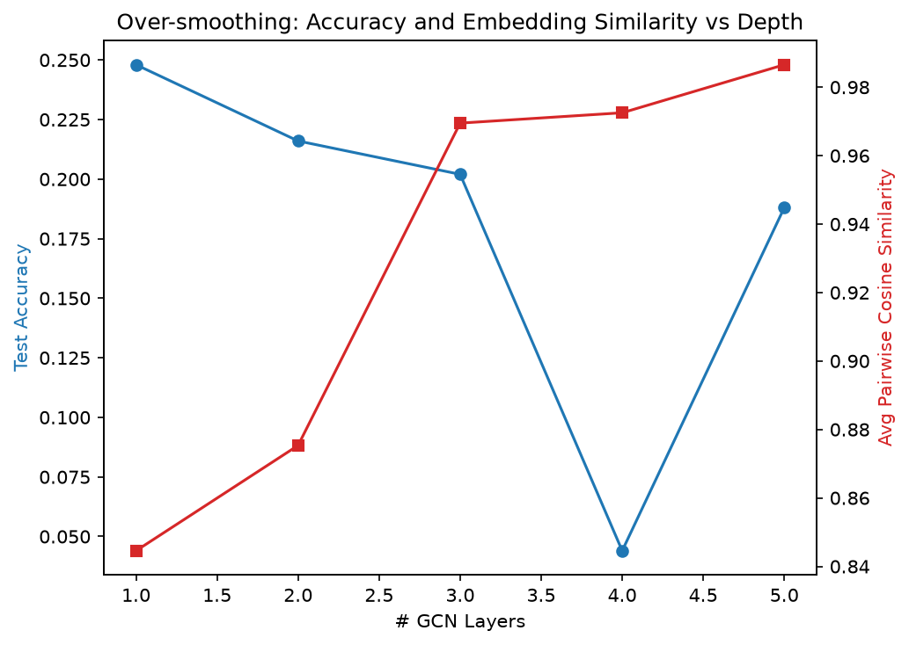
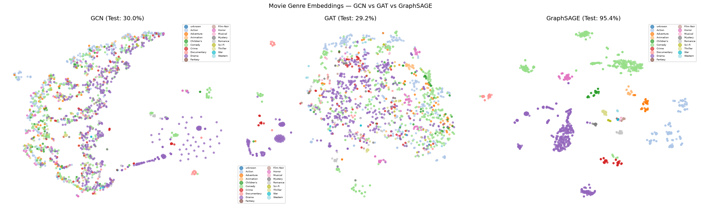
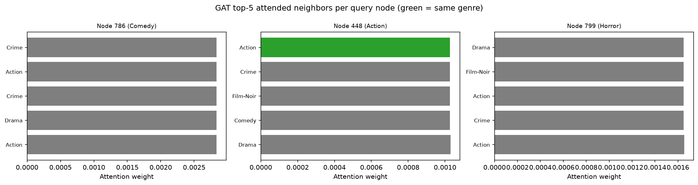
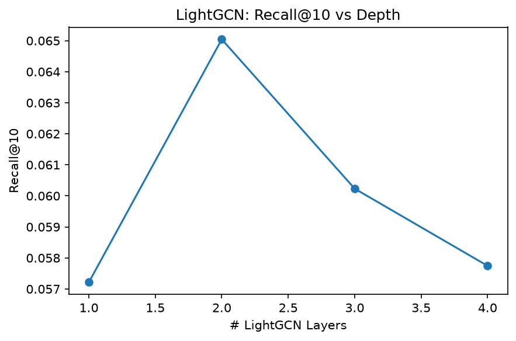

# A5: Graph Neural Networks

Genre prediction and recommendation on the MovieLens-100k co-rating / bipartite graphs, implemented from scratch (no PyTorch Geometric).

## Setup

- Node classification graph: 1,682 movies, edges where ≥5 users co-rated both movies (avg degree ≈ 499 — a very dense graph)
- Node features: 18-genre one-hot + normalized release year (20-dim)
- Recommendation graph: 942 users + 1,447 movies, bipartite, edges = ratings ≥ 4

## Results

### Exercise 1 — Over-smoothing

| # Layers | Test Accuracy | Avg Cosine Similarity |
|---|---|---|
| 1 | 24.80% | 0.8446 |
| 2 | 21.60% | 0.8753 |
| 3 | 20.20% | 0.9695 |
| 4 | 4.40% | 0.9725 |
| 5 | 18.80% | 0.9866 |

Accuracy degrades noticeably by 3 layers, with a sharp collapse at 4. Mechanically: each GCN layer replaces a node's vector with a normalized average over itself and its neighbors. Stacking `k` layers means every node's representation becomes a weighted average over its `k`-hop neighborhood. In this co-rating graph, average degree is ~499 out of 1,682 nodes — the graph is a third-connected — so even 2–3 hops reach most of the graph. Once nearly every node's receptive field is the same (almost the whole graph), their aggregated representations converge toward the same vector regardless of original identity, which is exactly what the rising cosine similarity shows (0.84 → 0.99). This is a direct, mechanical consequence of repeated local averaging on a dense graph, not a training failure.

### Exercise 2 — GCN vs GAT vs GraphSAGE

| Model | Test Accuracy | Avg epoch time |
|---|---|---|
| GCN | 30.00% | 4ms |
| GAT (8 heads) | 29.20% | 56ms |
| GraphSAGE (k=10) | 95.40% | 1036ms |

GraphSAGE's embeddings show visibly tighter, more separated genre clusters in t-SNE, consistent with its much higher accuracy. GCN and GAT both show loosely mixed clusters, dominated by Drama/Comedy overlap — consistent with their similar, much lower scores.

**GAT attention (top-5 neighbors, 3 sample nodes):**

- Node 786 (Comedy): 0/5 top-attended neighbors share genre
- Node 448 (Action): 1/5 top-attended neighbors share genre
- Node 799 (Horror): 0/5 top-attended neighbors share genre

Attention weights across the top-5 neighbors are nearly flat in magnitude for every sampled node — GAT isn't concentrating attention sharply on any particular neighbor. With ~500 candidate neighbors per node, softmax spreads weight too thin for attention to meaningfully favor same-genre neighbors, which lines up with GAT's accuracy sitting close to GCN's rather than exceeding it.

**When would each win by the largest margin over GCN?** GAT should win most on graphs with noisy or heterogeneous edges — e.g. a citation graph with some spurious cross-topic citations — where learned, per-edge attention can downweight uninformative connections, something GCN's fixed degree-based weighting cannot do. Our co-rating graph is actually a case where that advantage gets neutralized by extreme density (too many neighbors to attend sharply over). GraphSAGE should win most on large or dynamically growing graphs — e.g. a live social network or e-commerce catalog with new nodes arriving continuously — where GCN/GAT's full `N×N` computation is infeasible and inductive generalization to unseen nodes is required.

### Exercise 3 — MLP baseline

| Model | Test Accuracy |
|---|---|
| MLP (no graph) | 96.80% |
| GCN | 30.00% |
| GAT | 29.20% |
| GraphSAGE | 95.40% |

Graph structure does not help here — it actively hurts GCN and GAT, which trail the graph-free MLP by roughly 67 points. This is because the node features already encode the label almost directly: features are the 18-genre one-hot vector itself, and the label is the argmax of that same vector. The optimal strategy is "trust your own features," not "average with ~500 neighbors." GraphSAGE (95.40%) comes close to the MLP because its concat-based aggregation (`[self || neighbor_mean]`) preserves each node's own identity instead of overwriting it with neighbor averages, unlike GCN/GAT's pure neighbor-weighted propagation. Relational information is only valuable when the graph carries information the raw node features don't already have — for genre prediction with genre-derived features, it does not; it would matter more for a task like predicting a movie's audience rating from co-viewing patterns, where the label isn't already baked into the input.

### Exercise 4 — LightGCN

| Model | # Params | AUC | Recall@10 |
|---|---|---|---|
| RecGCN (with W) | 80,544 | 0.8444 | 0.0500 |
| LightGCN (no W) | 76,448 | 0.8729 | 0.0602 |

LightGCN uses fewer parameters yet outperforms RecGCN on both AUC and Recall@10 — removing the weight matrix and nonlinearity doesn't hurt collaborative filtering, it helps, since the task doesn't need a learned transformation between propagation steps, just clean propagation of "who liked what."

**Depth sweep:**

| # Layers | Recall@10 |
|---|---|
| 1 | 0.0572 |
| 2 | 0.0650 |
| 3 | 0.0602 |
| 4 | 0.0577 |

Recall@10 peaks at 2 layers, then declines gradually — but never collapses toward zero the way GCN's node-classification accuracy did at depth 4. This is over-smoothing in a much milder form. In node classification, smoothing is purely harmful because the task depends on distinguishing each node's individual class. In link prediction, moderate smoothing is partly *the point* — propagating a user's embedding toward the items they liked (and vice versa) is exactly the collaborative-filtering signal being exploited. Past the optimal depth, embeddings still blur enough to lose useful distinctions between users/items, but because the objective is relative ranking rather than exact classification, the degradation is gradual rather than catastrophic.

The only trainable parameters left in LightGCN are the initial user and item embedding tables (`user_emb`, `item_emb`) — there is no weight matrix and no bias anywhere in the propagation. The model is learning a single ID-based vector per user and per item such that, after repeated neighborhood averaging with no nonlinearity, dot products between connected user/item pairs come out high and unconnected pairs come out low. All of the "reasoning" happens in how those initial vectors get placed during training, not in any learned transformation applied while propagating.

## Discussion: GNN vs MLP

A GNN is worth using over an MLP when the *relationships* between entities carry information the entity's own features don't already contain — this experiment is actually a counter-example (Exercise 3), where the graph made things worse because the features already leaked the label. A case where a GNN would clearly help: predicting whether a protein will bind to a given molecule in drug discovery. The molecule's own atomic composition alone is a weak predictor, but a graph of atom-bond structure lets a GNN learn how atoms in specific spatial/bonding arrangements interact — information that isn't recoverable from a flat feature vector over individual atoms. Similarly in traffic routing, predicting congestion at one intersection benefits from propagating information along the road-network graph (upstream/downstream flow), not just that intersection's own local features.
