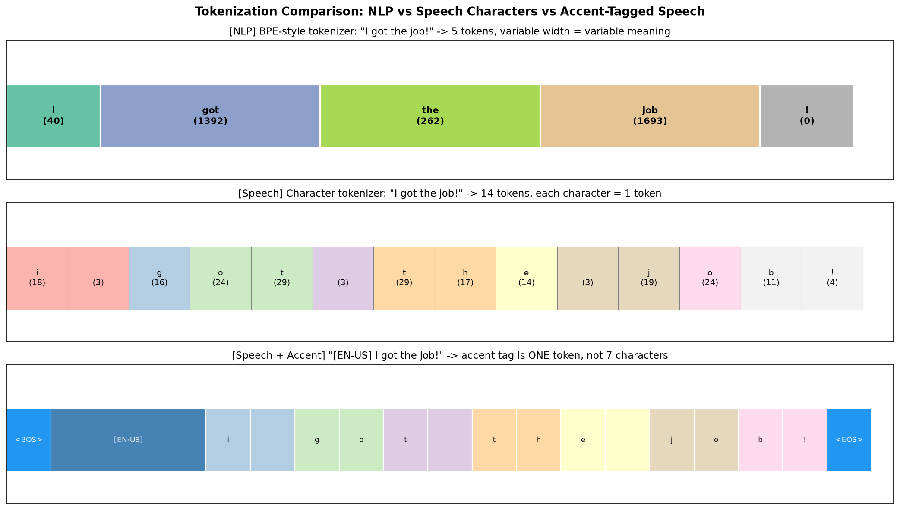
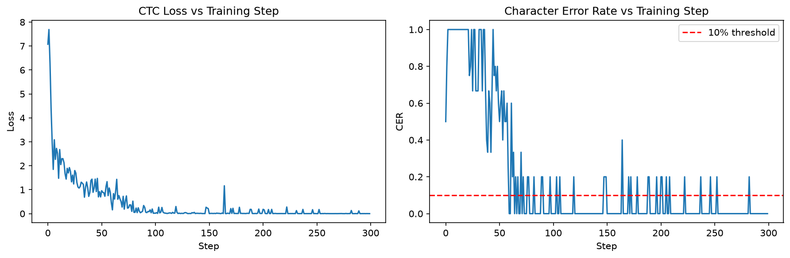
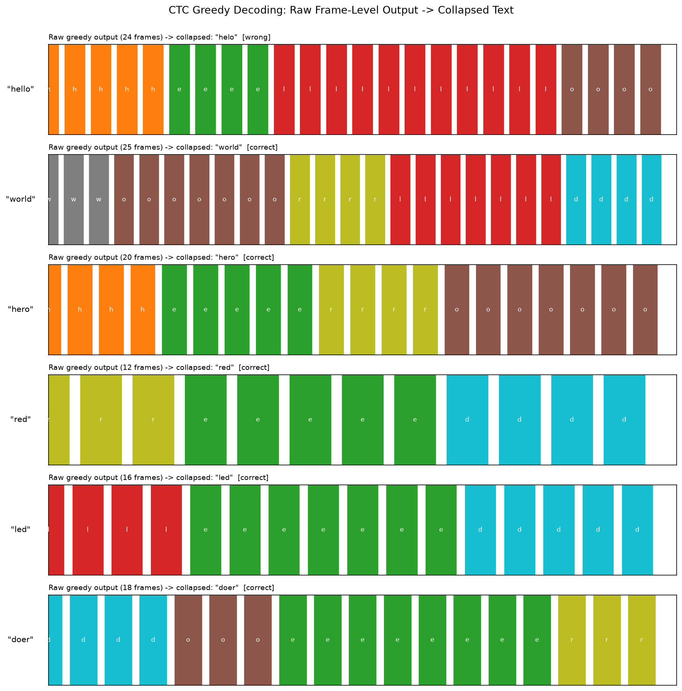
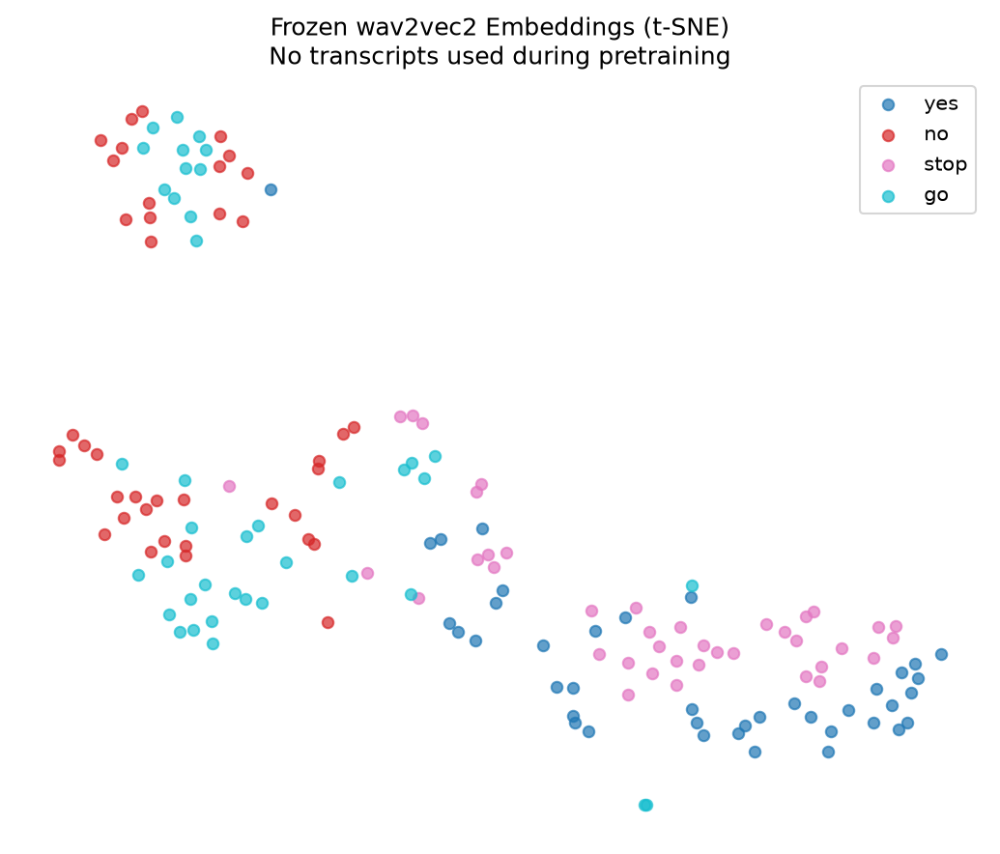
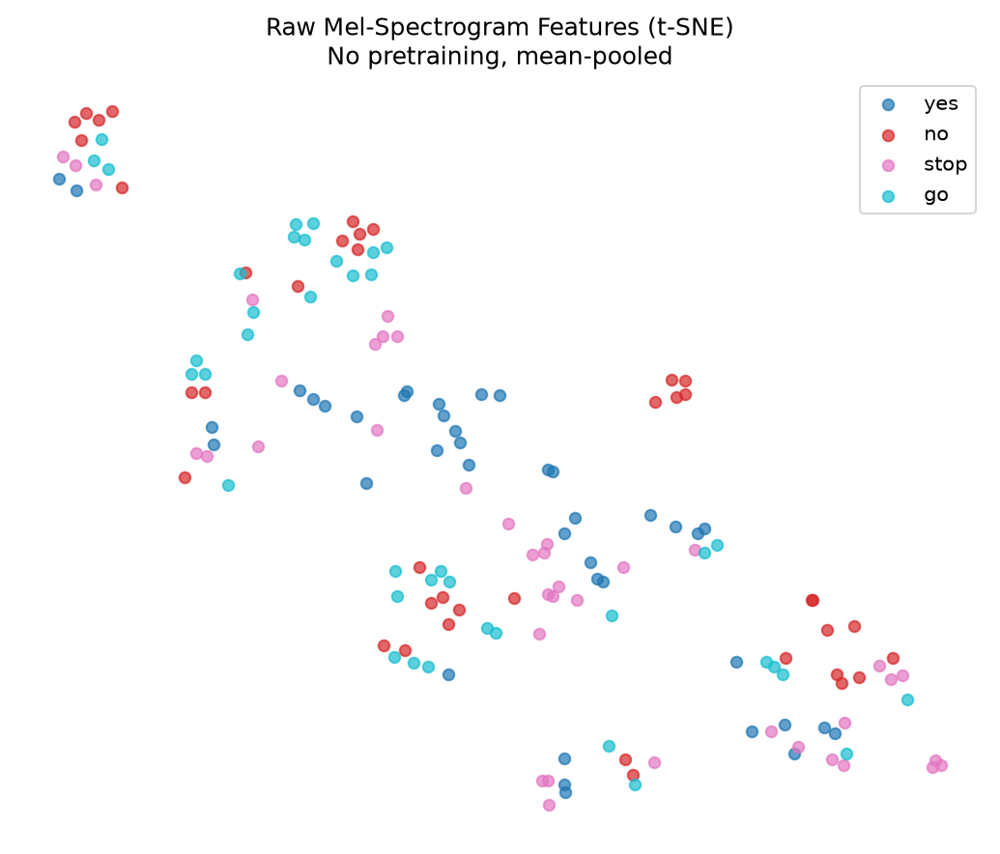
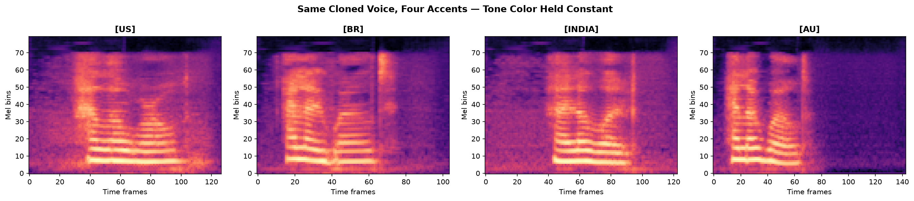

# A6: Speech Processing

Speech tokenization, mel spectrograms, CTC alignment, wav2vec2 probing, and OpenVoice voice cloning — implemented from scratch where possible, probing pretrained models where not.

## Commands Used

```bash
source code/.venv/bin/activate

# Train the toy CTC model (Part 3 / Exercise 2)
python3 run.py --model ctc --epochs 300 --train

# Linear-probe a pretrained wav2vec2 checkpoint (Part 4 / Exercise 3)
python3 run.py --model wav2vec2-probe --dataset speechcommands --classes yes,no,stop,go --train

# Extract tone color from reference clip
python3 run.py --model voice-clone --extract-se --reference my_voice.wav

# Synthesize in a given style with cloned voice
python3 run.py --model voice-clone --accent us --text "I got the job!" --generate

# Synthesize all styles for comparison
python3 run.py --model voice-clone --accent all --text "Hello world" --generate
```

## Results

### Exercise 1 — Speech vs NLP Tokenization

| Sentence | # Char tokens | # Tokens (with BOS/EOS) | Accent tag token ID |
|---|---|---|---|
| Hello, how are you? | 19 | 21 | — |
| Dr. Smith prescribed 10 tablets. | 36 | 38 | — |
| [EN-US] I got the job! | 15 | 17 | 36 |
| [EN-BR] I lost my wallet. | 18 | 20 | 37 |
| [EN-INDIA] This is completely unacceptable! | 33 | 35 | 38 |



**1b:** Normalization is critical because TTS ultimately has to produce *pronunciation*, not spelling. If the model received the literal string "Dr." as input, it would try to sound out the abbreviation character-by-character — "D-R-period" — rather than saying "doctor." Text normalization ensures the input to the model always matches how a human would actually read the sentence aloud, before any acoustic modeling happens.

**1c:** Both `[CLS]` and `[EN-US]` are a single embedding vector prepended to the sequence that the entire downstream network attends to at every step. `[CLS]` in BERT gets updated via self-attention across all tokens and ends up encoding a summary of the whole sequence for classification. `[EN-US]` works in the opposite direction — instead of *summarizing* the sequence, it *conditions* it: every subsequent character's processing can attend back to that one token, letting a single embedding steer pronunciation, rhythm, and accent for the entire utterance. Architecturally identical mechanism (one special token, embedded like any other, attended to globally); functionally opposite role (aggregation vs. conditioning).

### Exercise 2 — CTC: Verifying the Forward Algorithm

**2a — collapsing function:**
```
HHEELLLLOO -> HELO      (no blank between the two L's — they wrongly merge)
H_EE_LL_LO -> HELLO
H_E_L_L_O  -> HELLO
```
The second and third alignments correctly collapse to `HELLO`; the first is the exact ambiguity CTC's blank token exists to resolve — without a blank separating the genuinely-doubled `L`, it collapses to a single `L`.

**2b — forward probability of different target words:**

| Target | log P_CTC | P_CTC |
|---|---|---|
| HEL | -5.5957 | 0.003714 |
| LEH | -7.0833 | 0.000839 |

The two probabilities differ (~4.4x apart) because the forward algorithm sums over alignments in a specific *order* — it asks "what's the probability the model outputs H, then E, then L, in that sequence," not just whether the model produces these symbols anywhere. Since `log_probs` at each frame is a fixed distribution, an ordering that better matches which frames the model favors which characters at accumulates higher probability than a scrambled ordering.

**2c — character error rate curve:**



CER starts near 100% (random guessing) and drops below 10% by **step 59**, converging to 0% with final loss 0.0011.

**2d — shorter character durations, `frames_per_char=(1,2)` vs default `(3,8)`:**

| Setting | First CER<10% (3 seeds) | Final loss (3 seeds) |
|---|---|---|
| Short frames (1,2) | 9, 13, 11 | 0.0003, 0.0071, 0.0008 |
| Normal frames (3,8) | 79, 79, 76 | 0.0023, 0.0150, 0.0167 |

Counter-intuitively, **shorter character durations converged 6-8x faster**, consistent across all three seeds. This is the opposite of what "how many frames does the model need to agree on a character before collapsing" would predict for real audio, and the reason is specific to this synthetic task's construction: each frame independently draws a clean signature vector plus fixed-variance noise, with **no coarticulation or temporal smearing** between frames. In real speech, a shorter phoneme genuinely carries less usable signal (fewer independent noisy observations, adjacent sounds bleeding into boundaries) — that's the real mechanism the exercise points at. But in this toy generator, shortening `frames_per_char` doesn't remove information per frame; it just produces shorter overall sequences, which are easier and faster for a small BiLSTM to fit. The exercise's premise holds for realistic acoustic data; it doesn't transfer to this simplified synthetic setup.

**Greedy decoding grid:**



5/6 words decoded correctly; the one miss (`hello -> helo`) is a live example of the double-letter collapsing issue explained in 2a — the trained model didn't insert a blank between the two L's.

### Exercise 3 — wav2vec2: How Much Does Self-Supervision Buy You?

**3a:**

| Feature | Test Accuracy |
|---|---|
| Raw mel-spectrogram (mean-pooled) | 60.4% |
| wav2vec2 (frozen, mean-pooled) | 85.4% |

(4-way classification, random baseline 25.0%)




**3b:** The gap here is 25.0 percentage points, roughly 2.4x the mel baseline's own accuracy. In the SSL lab (A3), we compared SimCLR (61.82%), DINO (44.57%), and MAE (40.35%) against each other rather than against a raw-pixel-MLP baseline, so an exact numeric comparison isn't available. Both labs show the same underlying pattern though: a model with no self-supervised pretraining (raw mel features here) sits well below every pretrained encoder, and the specific objective matters a lot — SimCLR's contrastive objective beat DINO/MAE by 17-21 points at 10 epochs in A3; here wav2vec2's contrastive-plus-quantization objective produces a similarly large jump over the non-pretrained baseline.

**3c — 6-class expansion (yes/no/stop/go/up/down):**

| Feature | 4-class Acc | 6-class Acc |
|---|---|---|
| wav2vec2 | 85.4% | 73.6% |
| raw mel | 60.4% | 50.0% |

Accuracy dropped, but **not proportionally** to the added difficulty: random baseline dropped from 25.0% to 16.7% (33% relative drop), while wav2vec2 only dropped ~14% relatively. Relative to random, wav2vec2 actually improved (3.4x random at 4 classes vs 4.4x random at 6 classes) — the absolute drop reflects the task getting harder (more confusable word pairs), not the representation quality degrading.

**3d:** wav2vec2's contrastive objective produced a larger gap over its non-pretrained baseline (25.0pp) than MAE's reconstruction objective did against SimCLR's contrastive objective in A3 (21.5pp). Both point the same direction — contrastive objectives produced more linearly-separable representations than reconstruction objectives at these training budgets — but the comparison isn't fully fair: different modalities (audio vs. images), vastly different pretraining scale (wav2vec2: 960+ hours of LibriSpeech; A3 models: 10 epochs on CIFAR-10 from scratch), and different task difficulty. The consistent direction is real; attributing it cleanly to "contrastive > reconstructive" as a general law is not justified by this data alone.

### Exercise 4 — Voice Cloning: Identity, Style, and Language

**4a:**

| Accent | Duration (s) | RMS Energy | Mel Spectral Centroid (Hz) |
|---|---|---|---|
| us | 1.904 | 0.0519 | 1964.7 |
| br | 1.265 | 0.0774 | 1745.0 |
| india | 1.765 | 0.0446 | 1645.2 |
| au | 1.730 | 0.0744 | 1999.5 |



British and Australian show noticeably higher RMS energy than US and Indian — consistent with different prosodic emphasis/rhythm per accent, on the same underlying cloned voice.

**4b — tone color cosine similarity (reference vs. each generated clip):**

| Accent | Cosine Similarity |
|---|---|
| us | 0.6446 |
| br | 0.7021 |
| india | 0.7330 |
| au | 0.7010 |

If OpenVoice's disentanglement worked perfectly, these would be high and roughly equal across all four accents. What we see is moderate similarity (0.64-0.73), reasonably consistent (spread of ~0.09), but not high in an absolute sense. Two factors likely explain this: these are very short clips (1.2-1.9s from a single short sentence) versus the 22.9s reference, so the tone color extractor has much less signal to work with — some of the gap is short-clip embedding noise, not necessarily identity drift. Second, moderate-but-consistent similarity suggests imperfect but directionally-working disentanglement: the accent conversion doesn't collapse to a different speaker (similarities aren't near zero), but some tone color bleeds into the style variation — matching what listening confirmed: the accents were clearly audible, and it still sounded like the same underlying speaker.

## Discussion

Working through speech tokenization and CTC alignment reframes what "training an ASR/TTS model" actually means at a mechanical level: it's not just picking a bigger network, it's picking how to handle the fundamental mismatch between a continuous signal and a discrete target sequence — every design choice downstream (blanks, duration models, attention alignment) traces back to that one problem. A tone color embedding is a fundamentally different kind of object than a text token or a CTC blank because it isn't discrete or drawn from a fixed vocabulary the model was trained to predict — it's a continuous vector *extracted* from a specific audio signal, meant to capture something the model never explicitly labels or classifies (a speaker's identity). A text token or CTC blank has a clear, enumerable meaning fixed at training time; a tone color embedding's meaning is defined entirely by whatever reference clip produced it, making it closer to a learned, continuous "style code" than a member of a symbolic vocabulary.